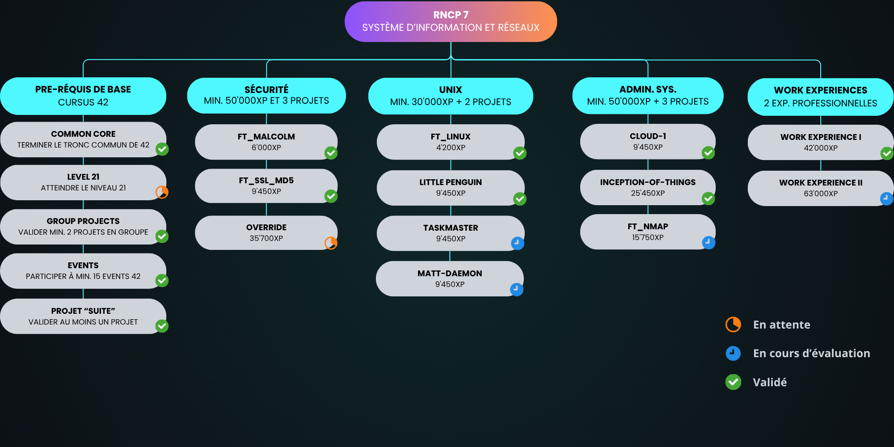

## Projects

### DEVOPS / SYSTEM ADMINISTRATION

---

### MOBILE

---

### WEB

---

### WEB3

---

### AI

---

### CYBERSECURITY

---

### UNIX

---

### FUNCTIONAL PROGRAMMING

---

### WORK EXPERIENCE

 
 

## Roadmap RNCP 6 - Concepteur développeur de solutions informatiques

Voir la fiche officielle du RNCP6 [ici](https://www.francecompetences.fr/recherche/rncp/39783/) (site officiel du gouvernement français)  
Documentation du RNCP6 pour les etudiants de 42 [ici](https://meta.intra.42.fr/articles/rncp-6-certificate)  

**Objectif** : Obtenir le **RNCP6 option Développement Web et Mobile**

 

**Objectif** : Obtenir le **RNCP6 option Développement d'Applications**

 
 

## Roadmap RNCP7 - Expert en architecture informatique

Voir la fiche officielle du RNCP7 [ici](https://www.francecompetences.fr/recherche/rncp/39774/) (site officiel du gouvernement français)  
Documentation du RNCP7 pour les etudiants de 42 [ici](https://meta.intra.42.fr/articles/rncp-7-certificate)  

**Objectif** : Obtenir le **RNCP7 option Système d'Information et Réseaux**

